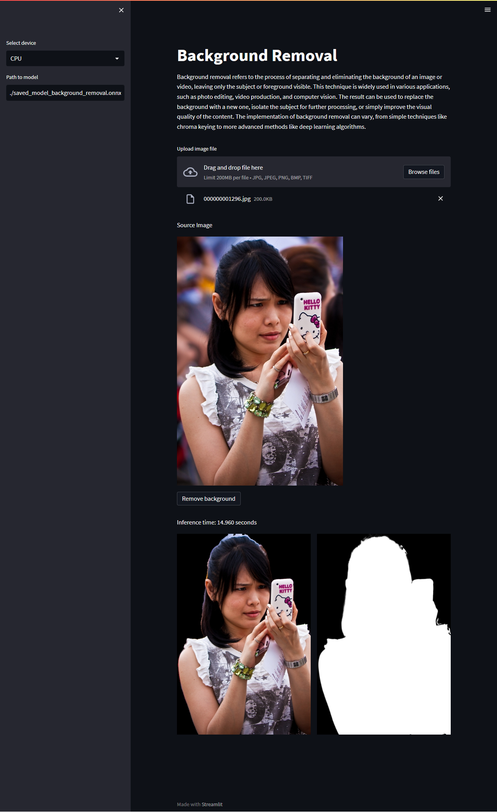

# Inanimate Face Liveness



## Description

Background removal refers to the process of separating and eliminating the background of an image or video, leaving only the subject or foreground visible. This technique is widely used in various applications, such as photo editing, video production, and computer vision. The result can be used to replace the background with a new one, isolate the subject for further processing, or simply improve the visual quality of the content. The implementation of background removal can vary, from simple techniques like chroma keying to more advanced methods like deep learning algorithms.

## Installation

Please use python version 3.8.10 or above

```bash
git clone https://github.com/hafidh561/background-removal.git
pip3 install -r requirements.txt
python3 download_model.py
```

## Usage

```bash
streamlit run app.py
```

## License

[MIT LICENSE](./LICENSE)

© Developed by [hafidh561](https://github.com/hafidh561)
